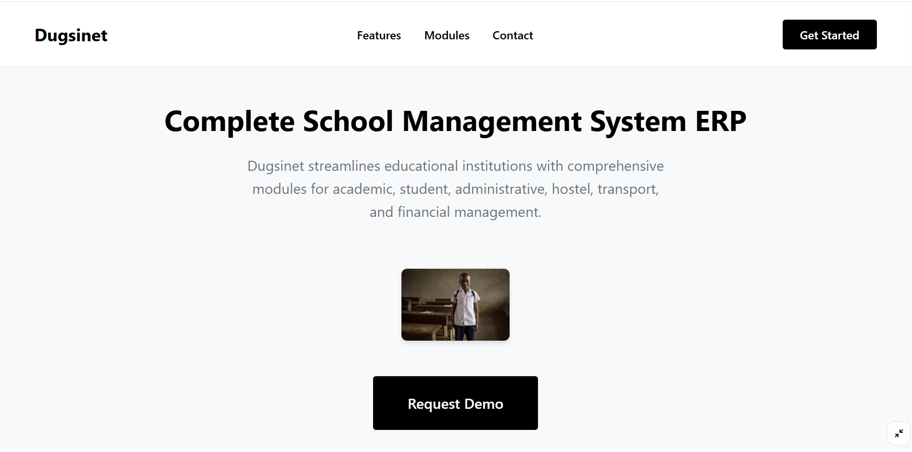
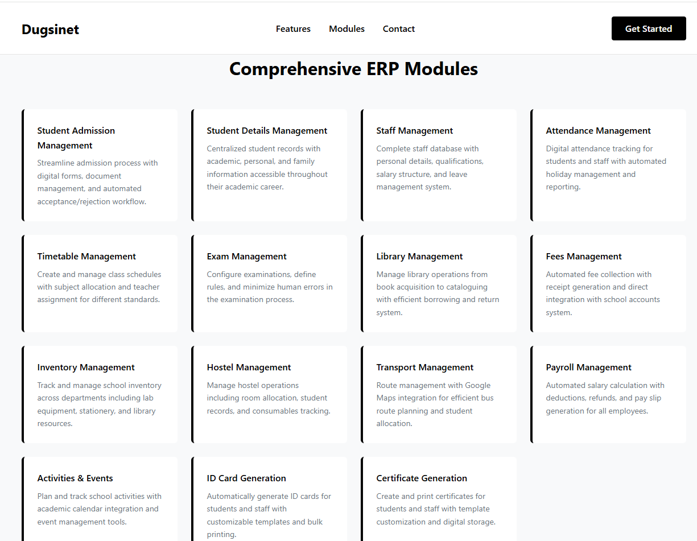

# Dugsinet


Dugsinet is a modern, brandable platform inspired by Somali culture, designed for academic and tech-centered communities.





---

## 🚀 Tech Stack

- **Frontend:** React + Vite ([Netlify](https://www.netlify.com/) hosted)
- **Backend:** [Supabase](https://supabase.com/) (PostgreSQL DB, Supabase Auth, Edge Functions)
- **Styling:** [Tailwind CSS](https://tailwindcss.com/)
- **Optional Backend Logic:** Netlify Functions (role-protected logic, file generation, etc.)

---

## 🎯 Key Features

### 🔐 Authentication & Roles

- Supabase Auth (email/password login)
- Role-based access: `admin`, `staff`, `student`, `parent`
- Supabase Row-Level Security (RLS) & policies for data protection

### 🧩 Core Modules

#### 📚 Academic & Student Management
- Student Admission Form (file uploads: birth certificate, report card)
- Student Info CRUD (GR No., previous school history, etc.)
- Class & Stream assignment with academic year tagging

#### 👨‍🏫 Staff Management
- Staff profile creation
- Leave balance, role assignment, salary structure
- Freeze/Unfreeze staff status

#### 🗓️ Attendance
- Attendance system for students and staff
- Auto-skip weekends/holidays (based on academic year)

#### ⏱️ Timetable
- Create/Edit/Assign class-wise timetable
- View by student and teacher dashboards

#### 📝 Exams
- Create exams, rules, subjects, grading criteria
- Enter and view marks

#### 📖 Library
- Book catalog, borrowing history, overdue reminders
- Real-time stock tracking

#### 💰 Fees Management
- Define fee slabs (monthly, quarterly, etc.)
- Payment tracking, due alerts, generate receipts

#### 🏠 Hostel
- Hostel room allocation, visitor logs, inventory

#### 🚌 Transport
- Define routes & stops (Google Maps API)
- Assign students/staff to routes

#### 🧾 Payroll
- Salary generation, tax & deduction management
- Payslip download & email

#### 🗓️ Activities & Events
- Add yearly events to shared calendar
- View by student and staff dashboards

#### 🆔 ID & Certificate Generator
- Dynamic template-based ID card/certificate generation (PDF)
- Print and save option

#### 📦 Inventory
- Track stock levels across departments
- Vendor management

---

## 🔐 Backend & Database Notes (Supabase)

- PostgreSQL tables for each entity/module (students, staff, attendance, etc.)
- Foreign key relationships (e.g., students to class, staff to subject)
- Row-Level Security (RLS) for role-based access
- Supabase Storage for photos/documents (ID photos, certificates)

---

## 🚀 Hosting & Deployment

- **Frontend:** Hosted on Netlify (auto-deploy from GitHub)
- **Backend:** Supabase (connect via environment variables)
- **Netlify Functions:** For protected certificate/ID generation, scheduled reports (optional)

---

## 🧪 Project Deliverables

- GitHub repo with clean structure
- `.env.example` with Supabase credentials template
- Supabase schema SQL or migration scripts
- Full README with setup & usage guide
- Live working version on Netlify

---

## 🎁 Bonus Features (Optional)

- Email notifications (overdue fees, upcoming exams)
- Dashboard analytics (charts for student count, attendance stats, etc.)
- Multilingual interface (English, Somali, Amharic)
- PWA for offline attendance/transport logs

---

## 🛠️ Setup & Usage Guide

### 1. Clone the Repository

```sh
git clone https://github.com/bitbirr/dugsinet.git

cd dugsinet

npm install

3. Configure Environment Variables
Copy .env.example to .env and fill in your Supabase credentials.

4. Supabase Setup
Create a Supabase project.
Run provided SQL/migration scripts to set up tables, relationships, and RLS policies.
Enable Supabase Storage for file uploads.

5. Run Locally

6. Deploy
Connect your repo to Netlify for frontend hosting.
Set environment variables in Netlify dashboard.
Backend logic via Supabase Edge Functions and Netlify Functions.
📄 License
MIT

🤝 Contributing
Pull requests and suggestions welcome! Please follow the code of conduct.

📬 Contact
For questions or support, open an issue or email info@bitbirr.net


You can further customize the contact, contributing, and license sections as needed. This README covers all modules, tech stack, setup, and deployment instructions